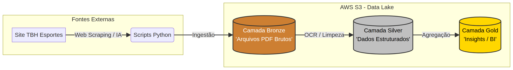

# 🔍 Etapa 3 — Tratamento dos Dados

Para este projeto, foi estruturado um Data Lakehouse seguindo o padrão da Arquitetura Medalhão (Medallion Architecture), amplamente utilizada em pipelines modernos de dados.

O Amazon S3 (AWS) foi utilizado para hospedar a Camada Bronze. Nesta etapa, os arquivos são armazenados em seu formato original (raw data), garantindo a preservação da 'fonte da verdade' e possibilitando reprocessamentos, auditorias e futuras transformações sem perda de integridade.

Essa abordagem assegura alta confiabilidade, rastreabilidade e flexibilidade ao longo de todo o ciclo de vida dos dados.

Com os dados armazenados na camada Bronze, foi desenvolvido um script em Python, com apoio de Inteligência Artificial (IA), para realizar a extração das informações contidas em arquivos no formato PDF e sua conversão para o formato Parquet, estruturado e otimizado para dados tabulares.

Para a execução desse processo de transformação, foi utilizado o Google Colab. Ao final da etapa, os dados já estruturados foram carregados em um novo bucket no Amazon S3, representando a camada Silver da arquitetura.

-------

## 🚦 Desafios

> "A inteligência artificial é a nova eletricidade, mas ainda precisamos de humanos para decidir como usá-la." — Andrew Ng

O uso da Inteligência Artificial até este momento do projeto foi essencial, pois viabilizou a extração automatizada dos dados e apoiou na criação de scripts em Python, linguagem na qual ainda estou em desenvolvimento. Sua utilização agregou agilidade ao processo e contribuiu para a evolução técnica ao longo do projeto.

No entanto, o uso isolado da IA não é suficiente para gerar valor. É fundamental que haja análise crítica e compreensão dos resultados obtidos, garantindo que as informações sejam interpretadas de forma correta e aplicada de maneira estratégica.

Dessa forma, utilizar IA sem o devido entendimento dos resultados limita seu potencial e pode comprometer a qualidade das entregas.

---

## 📌 Diferença entre os cabeçalhos

O primeiro desafio enfrentado nesta etapa foi a padronização das estruturas dos arquivos.

Dos 117 arquivos armazenados na camada Bronze (S3), foram identificados três padrões distintos de cabeçalho, conforme descrito abaixo:

>**Tipo 1 (108 arquivos)**  
('Coloc.', 'Num.', 'Nome', 'Sx.', 'Idd.', 'Faixa', 'Cl.Fx.', 'Equipe', 'Tempo', 'Liquido')

>**Tipo 2 (2 arquivos)** 
('Coloc.', **'Numero'**, 'Nome', 'Sx.', **'Id.'**, **'Fx.Et.'**, 'Cl.Fx.', **'C.'**, 'Equipe', 'Tempo')

>**Tipo 3 (3 arquivos)** 
('Coloc.', 'Número', 'Nome', **'Id.'**, 'Faixa', **'C.F.'**, 'Equipe', **'Corrida'**, **'Ciclismo'**, **'Corrida'**, 'Tempo')

 

O Tipo 1, por estar presente na grande maioria dos arquivos, foi definido como padrão de referência.

### 🔧 Ajustes Realizados

Para garantir consistência na estrutura e viabilizar análises posteriores, foram aplicadas as seguintes transformações:

* Padronização dos nomes das colunas dos arquivos do Tipo 2, adequando-os ao formato do Tipo 1;

* Remoção da coluna *líquido* nos arquivos do tipo 1, por não estar preenchida de forma consistente em todas as corridas;
* Remoção da coluna *C* nos arquivos do tipo 2, por apresentar valores nulos e não agregar valor à análise.

 

### 🚴 Exclusão de Arquivos — Tipo 3 (Duatlo)

Os arquivos classificados como tipo 3 correspondem a corridas no formato **duatlo**, que combinam modalidades de corrida e ciclismo e, por isso, apresentam uma estrutura de dados distinta das demais.

Arquivos identificados:

* Corrida_do_América_2026_GERAL-DUATLHON-REVEZAMENTO
* Corrida_do_América_2026_GERAL-DUATLHON-SIMPLES-FEMININO
* Corrida_do_América_2026_GERAL-DUATLHON-SIMPLES-MASCULINO

Devido às particularidades desse tipo de evento, esses arquivos não foram processados nesta etapa para a camada Silver.

 

### ⚠️ Arquivos Não Classificados

Após o processo de padronização, 113 arquivos foram classificados com sucesso.
Entretanto, 4 arquivos não tiveram seu padrão identificado automaticamente, sendo eles:

* Corrida_Divas_na_Pista_2026_5KM-FEMININO
* Corrida_Farid_2026_-_Etapa_Ouro_Branco_COLABORADORES-10KM-MASCULINO
* Corrida_Farid_2026_-_Etapa_Ouro_Branco_COLABORADORES-5KM-MASCULINO
* Corrida_do_América_2026_GERAL-FEMININO-15KM

#### 📌 Análise dos Casos

**Corrida_Divas_na_Pista_2026_5KM-FEMININO**  
Arquivo com estrutura fora do padrão utilizado, sendo removido da base nesta etapa.

**Demais arquivos**  
O código inicial apresentava limitações, descartando arquivos com:

    - Apenas uma página
    - Pequenas variações estruturais (ex.: espaços em branco antes do cabeçalho)
    
#### 🔄 Evolução do Pipeline

O script foi aprimorado para:

    - Identificar dados mesmo com variações de formatação;
    - Ignorar inconsistências como espaços extras;
    - Processar corretamente arquivos de página única;
    - Lidar com colunas adicionais inesperadas.

---

## 📌 Inclusão dos metadados como colunas

Na etapa extração, os atributos que identificavam as corridas estavam incorporados ao nome dos arquivos, 
o que limitava sua utilização para análises estruturadas.

Nesta etapa, foi realizado um processo de **enriquecimento e modelagem dos dados**, no qual essas informações foram extraídas, tratadas e convertidas em colunas estruturadas. Essa abordagem permite maior flexibilidade para consultas e padronização do dataset.

As colunas derivadas do metadado foram:

* **Corrida**: identifica o nome do evento;
* **Genero**: categoria do participante (Feminino ou Masculino);
* **Distancia_km**: representa a distância percorrida na prova;
* **Arquivo**: mantém o nome do arquivo de origem, garantindo rastreabilidade e suporte a auditorias;
* **Data**: indica a data de realização do evento.

---

## 📂 Particionamento dos Dados

Para otimizar consultas e organização dos dados, foi adotado o particionamento baseado na data da corrida:

/silver/  
    └── corridas/   
    &nbsp;&nbsp;&nbsp;&nbsp;├── dt=2026-05-03/ │    
    &nbsp;&nbsp;&nbsp;&nbsp;&nbsp;&nbsp;&nbsp;&nbsp;&nbsp;&nbsp;&nbsp;&nbsp;&nbsp;&nbsp;&nbsp;&nbsp;&nbsp; ├── part-000.parquet │ 
    &nbsp;&nbsp;&nbsp;&nbsp;&nbsp;&nbsp;&nbsp;&nbsp;&nbsp;&nbsp;&nbsp;&nbsp;&nbsp;&nbsp;&nbsp;&nbsp;&nbsp; ├── part-001.parquet │ 
    
✅ Benefícios  
- Redução do volume de dados lidos em consultas  
- Melhor desempenho em engines distribuídas (ex: Spark, Athena)  
- Organização lógica baseada em evento temporal  

 
⚠️ Over-partitioning  

Embora o particionamento traga ganhos de performance, o uso excessivo (over-partitioning) pode gerar efeitos adversos, como: 

- Criação de um grande número de diretórios pequenos; 
- Aumento do custo de leitura de metadados;  
- Degradação de performance em consultas.  

Por exemplo, particionar adicionalmente por:

 - gênero
- distância

poderia fragmentar excessivamente os dados, sem ganho proporcional de performance.

👉 Por isso, o particionamento foi definido com base no principal padrão de consulta esperado, que neste caso é a análise por data da corrida.

----
## 🧹 Tratamentos Adicionais

Além das padronizações estruturais, foram realizados:

- Remoção de cabeçalhos duplicados ao longo das páginas dos PDFs; 
- Exclusão de linhas em branco;
- Conversão dos arquivos de PDF → Parquet, otimizando performance e armazenamento;
- Criação de um pipeline de transformação para ingestão na camada Silver.

---
### 🚀 Conclusão

Esta etapa foi fundamental para transformar dados brutos e heterogêneos em uma base estruturada, consistente e confiável.

A partir deste ponto, a camada Bronze foi efetivamente consolidada, com todos os arquivos tratados e convertidos para um formato tabular padronizado, eliminando inconsistências estruturais e garantindo qualidade mínima para evolução do pipeline.

Os dados passam, então, a estar:

- Estruturados em formato analítico (colunar)  
- Padronizados entre diferentes fontes e layouts  
- Prontos para etapas de enriquecimento e modelagem na camada Gold.

Com isso, o projeto evolui de uma fase de ingestão e tratamento inicial para um estágio mais estratégico, onde os dados já podem ser refinados, relacionados .

Em resumo, esta etapa estabelece a fundação do pipeline de dados, garantindo escalabilidade, governança e qualidade para as próximas fases.